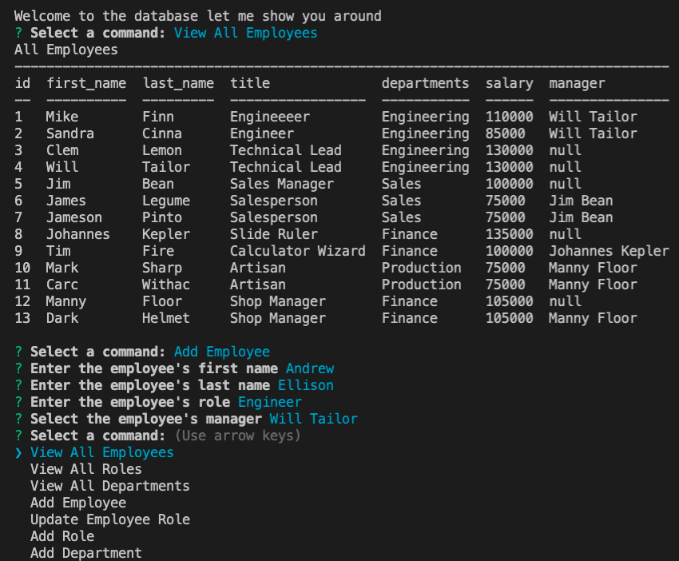

# Employee Database CLI

## Description

This command line interface allows users to view and edit employee data stored in a local MySQL database. This application is based in Node.js and uses the Inquirer and MySQL2 node packages.

See a walkthrough video at: [Walkthrough](https://watch.screencastify.com/v/fqAXGxM8vMajXQ54xVsI)




## Table of Contents

- [Installation](#installation)
- [How to Use](#how-to-use)
- [Questions](#questions)
- [License](#license)

## Installation

This project can be cloned from this database and used with a local MySQL server.

## How to Use

To start using the employee database, a user can run the schema and seeds sql file with

```console
  mysql -u root -p < db/schema.sql < db/seeds.sql
```

Then the application can be run from the command line with

```console
  node server.js
```

The interface will then prompt the user to select from view, create, and update operations.

## Questions

Find my other projects at: [ellisonac](https://github.com/ellisonac)

Contact me at: acannonellison@gmail.com

## License


This project is covered under the following license:

MIT License

Copyright (c) [2021]

Permission is hereby granted, free of charge, to any person obtaining a copy
of this software and associated documentation files (the "Software"), to deal
in the Software without restriction, including without limitation the rights
to use, copy, modify, merge, publish, distribute, sublicense, and/or sell
copies of the Software, and to permit persons to whom the Software is
furnished to do so, subject to the following conditions:

The above copyright notice and this permission notice shall be included in all
copies or substantial portions of the Software.

THE SOFTWARE IS PROVIDED "AS IS", WITHOUT WARRANTY OF ANY KIND, EXPRESS OR
IMPLIED, INCLUDING BUT NOT LIMITED TO THE WARRANTIES OF MERCHANTABILITY,
FITNESS FOR A PARTICULAR PURPOSE AND NONINFRINGEMENT. IN NO EVENT SHALL THE
AUTHORS OR COPYRIGHT HOLDERS BE LIABLE FOR ANY CLAIM, DAMAGES OR OTHER
LIABILITY, WHETHER IN AN ACTION OF CONTRACT, TORT OR OTHERWISE, ARISING FROM,
OUT OF OR IN CONNECTION WITH THE SOFTWARE OR THE USE OR OTHER DEALINGS IN THE
SOFTWARE.
